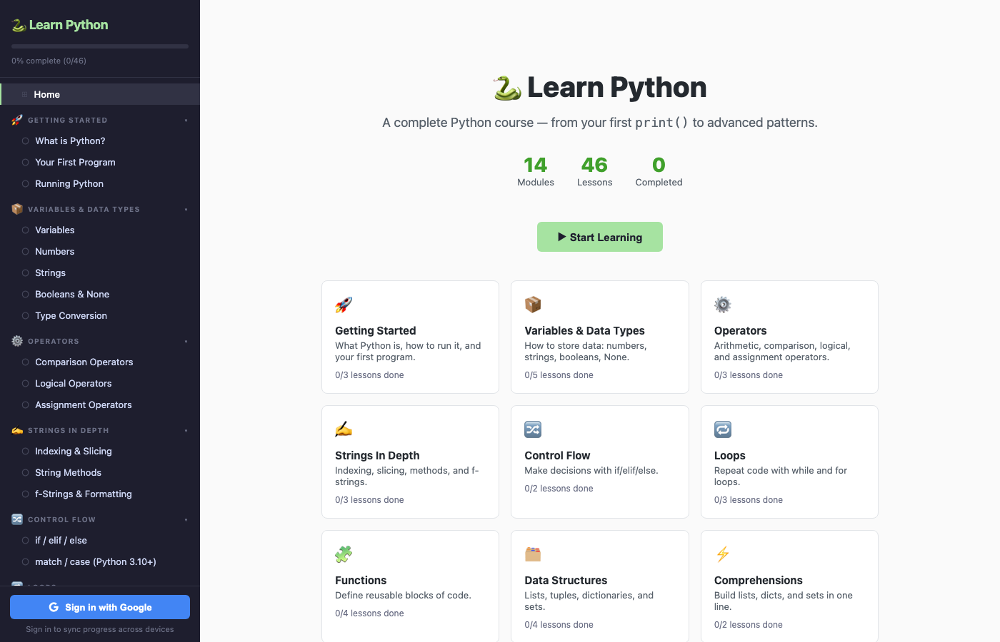
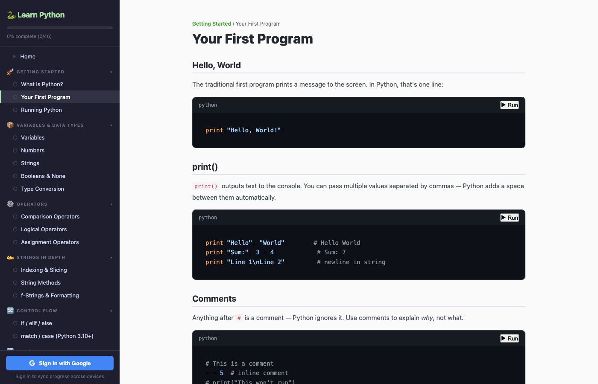

# 🐍 Learn Python

A complete Python course that runs entirely in your browser — from your first `print()` to advanced patterns. Sign in with Google and your progress syncs across every device.

## 🔗 Live site

**[https://learn-python-385cc.firebaseapp.com](https://learn-python-385cc.firebaseapp.com)**



## Features

- **Interactive Python runner** — every code block has a ▶ Run button. Real Python 3 executes in your browser via [Skulpt](https://skulpt.org). No install, no setup, no backend.
- **14 modules, 46 lessons** — a structured path from "what is a variable?" to decorators, generators, and OOP.
- **Google sign-in + cloud progress sync** — sign in once and your completed lessons follow you across phone, tablet, and laptop. Powered by Firebase Authentication and Firestore.
- **Works without an account** — progress saves to `localStorage` if you don't sign in. Sign in later and it merges to the cloud.
- **Syntax-highlighted code** — every snippet styled with [highlight.js](https://highlightjs.org).
- **No build step** — just static HTML, CSS, and JavaScript.



## What you'll learn

1. **Getting Started** — what Python is, how to run it, your first program
2. **Variables & Data Types** — numbers, strings, booleans, None, type conversion
3. **Operators** — comparison, logical, and assignment operators
4. **Strings In Depth** — indexing, slicing, string methods, f-strings
5. **Control Flow** — if/elif/else and match/case
6. **Loops** — while, for, range, break and continue
7. **Functions** — definitions, arguments, return values, scope, lambdas
8. **Data Structures** — lists, tuples, dictionaries, sets
9. **Comprehensions** — list, dict, and set comprehensions
10. **Error Handling** — try/except, raising errors, custom exceptions
11. **File I/O** — reading and writing files
12. **Object-Oriented Programming** — classes, inheritance, dunders
13. **Modules & Packages** — imports, the standard library, pip basics
14. **Advanced Python** — decorators, generators, context managers

## Tech stack

- **[Skulpt](https://skulpt.org)** — Python 3 interpreter compiled to JavaScript. Powers the in-browser code runner.
- **[Firebase Authentication](https://firebase.google.com/docs/auth)** — Google sign-in via OAuth.
- **[Cloud Firestore](https://firebase.google.com/docs/firestore)** — per-user progress storage.
- **[Firebase Hosting](https://firebase.google.com/docs/hosting)** — serves the static site at `learn-python-385cc.firebaseapp.com`.
- **[highlight.js](https://highlightjs.org)** — syntax highlighting for code blocks.
- Vanilla HTML, CSS, and JavaScript — no framework, no bundler.

## Running locally

It's static — no install required. The cloud sync features won't work locally (they need the registered OAuth domain), but the course content and Python runner do:

```bash
# Just open the file
open index.html

# Or serve over HTTP
python3 -m http.server 8000
# then visit http://localhost:8000
```

## Deploying your own copy

If you want to fork this and host your own version with cloud sync, you'll need a Firebase project:

1. Create a project at [console.firebase.google.com](https://console.firebase.google.com)
2. Enable **Authentication → Google sign-in**
3. Create a **Firestore** database (test mode is fine to start)
4. Copy your project's web config into `app.js` (the `firebaseConfig` object)
5. Deploy with the Firebase CLI:

   ```bash
   npm install -g firebase-tools
   firebase login
   firebase deploy --project YOUR_PROJECT_ID
   ```

The `firebase.json`, `.firebaserc`, and `firestore.rules` in this repo are ready to use — just point them at your project.

## Project structure

```
.
├── index.html        # shell — sidebar, main pane, script tags
├── style.css         # all styling
├── app.js            # routing, Skulpt runner, Firebase auth, progress sync
├── curriculum.js     # every lesson — content, code samples, key points
├── firebase.json     # Firebase Hosting + Firestore config
├── firestore.rules   # security rules — users can only read/write their own doc
├── .firebaserc       # which Firebase project to deploy to
└── screenshots/      # README images
```

Lesson content lives in `curriculum.js` as a single array. Each module has lessons; each lesson has HTML content and an optional `tryCode` sandbox.

## Credits

Built with [Skulpt](https://skulpt.org), [Firebase](https://firebase.google.com), and [highlight.js](https://highlightjs.org).
